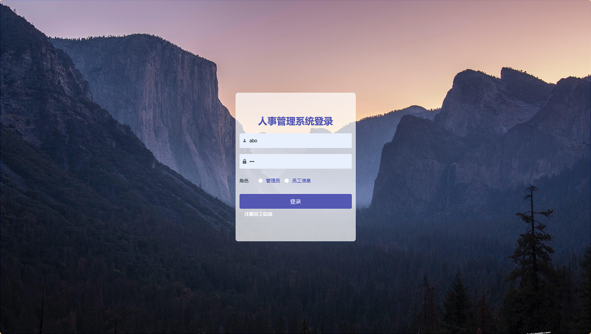
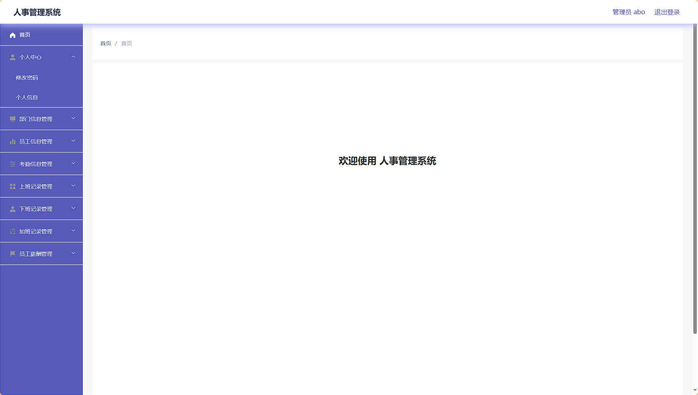
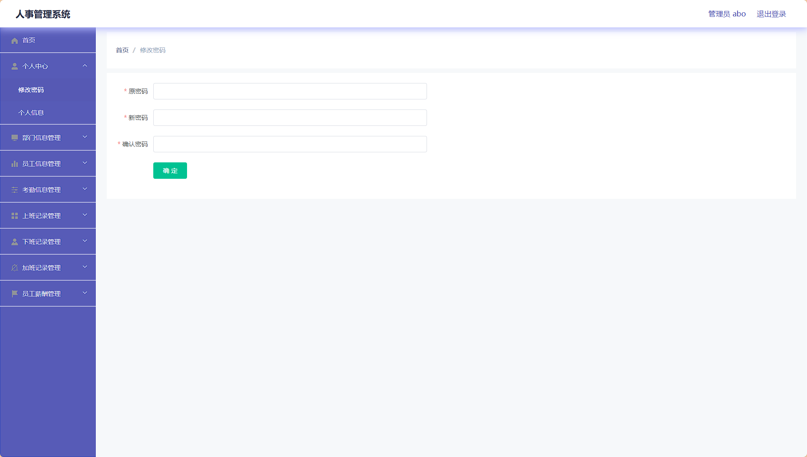
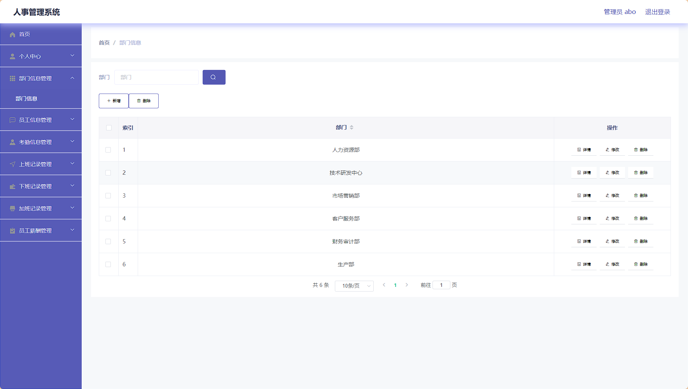
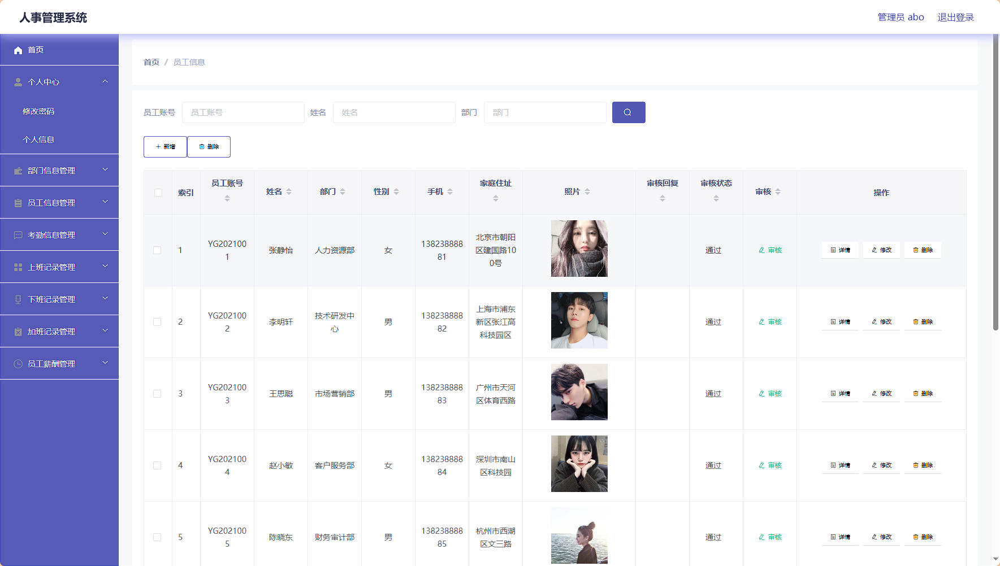
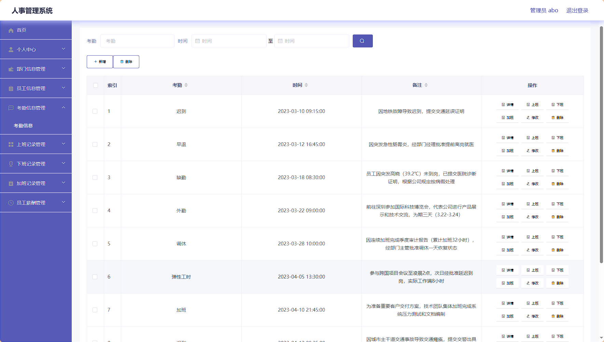
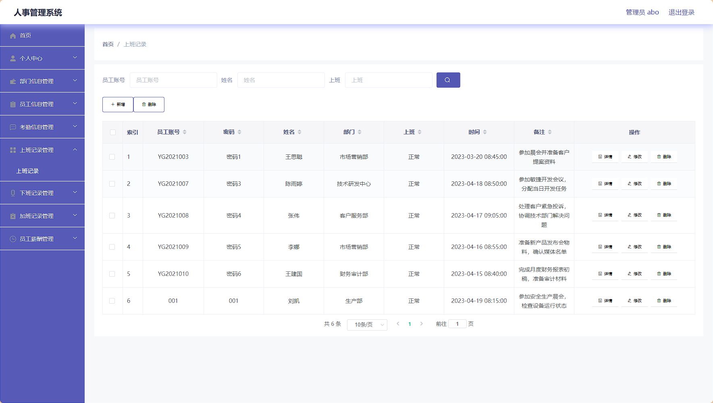
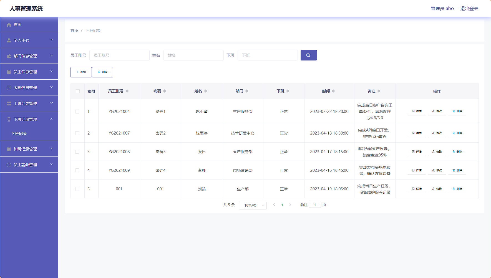
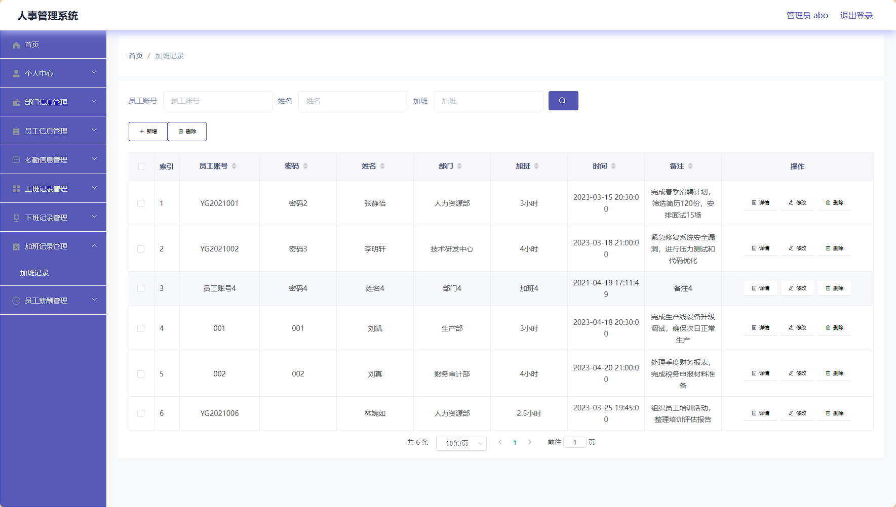
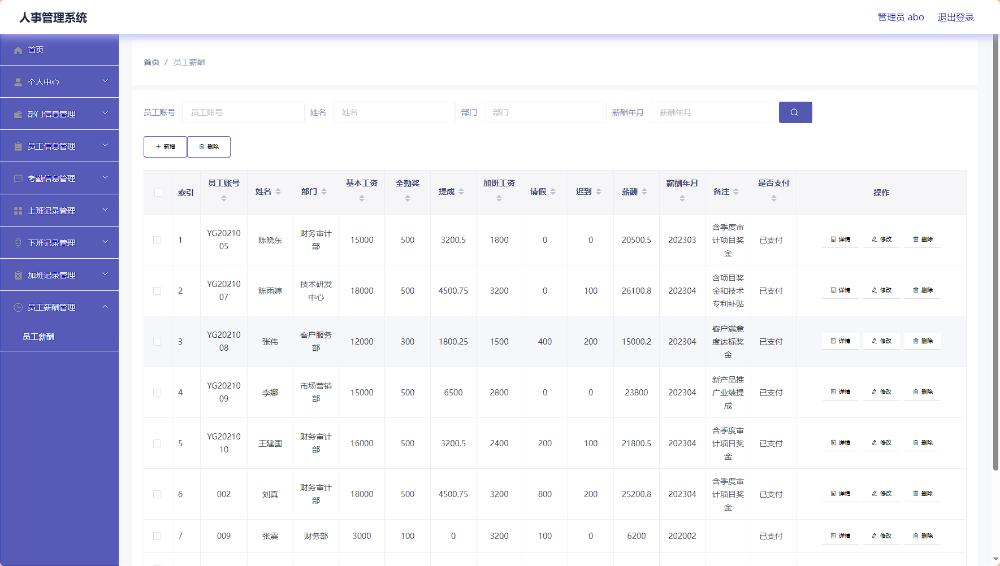

# springboot066人事系统 / springboot066-Personnel-System


> 更多毕设项目可跳转至项目导航栏检索：[毕设项目](http://sysadmin.3vfree.vip)，需要联系博主v：xq-lucky311，q：1047944234. 备注：项目咨询注：由于前端项目太大，仅上传了后端代码，未包含前端代码...

## 项目简介  
基于 SpringBoot + Vue 的 B/S 架构人事管理系统，采用 SSM 框架实现核心业务逻辑。系统包含管理员和员工双角色权限控制，支持部门管理、员工考勤、上下班记录、加班管理、薪酬核算等核心人事功能，通过 MyBatis Plus 实现高效数据持久化操作。

## 特征介绍  
- **权限分层**：Shiro 实现管理员/员工双角色动态权限控制，支持接口级安全拦截。  
- **高效持久层**：MyBatis Plus 简化数据库操作，零 SQL 实现单表 CRUD 功能。  
- **模块化实体**：三层实体结构（VO/View/Model）实现数据模型分离，增强系统扩展性。  
- **工具集成**：内置 MD5 加密、文件操作、百度 AI 等工具类，提升开发效率。  
- **注解鉴权**：自定义 `@LoginUser`、`@IgnoreAuth` 注解实现灵活权限控制。  

## 代码结构 
```
src/
├── main/
│   ├── java/
│   │   ├── com/
│   │   │   ├── SpringbootSchemaApplication.java      # 启动类
│   │   │   ├── annotation/                          # 鉴权注解
│   │   │   │   ├── LoginUser.java
│   │   │   │   ├── IgnoreAuth.java
│   │   │   ├── config/                              # 全局配置
│   │   │   │   ├── InterceptorConfig.java
│   │   │   │   ├── MybatisPlusConfig.java
│   │   │   ├── controller/                          # 接口层
│   │   │   │   ├── BumenxinxiController.java
│   │   │   │   ├── KaoqinxinxiController.java
│   │   │   ├── dao/                                 # 数据访问层
│   │   │   │   ├── BumenxinxiDao.java
│   │   │   │   ├── KaoqinxinxiDao.java
│   │   │   ├── entity/                              # 数据模型
│   │   │   │   ├── BumenxinxiEntity.java
│   │   │   │   ├── model/                           # 业务模型
│   │   │   │   │   ├── KaoqinxinxiModel.java
│   │   │   │   ├── view/                            # 视图模型
│   │   │   │   ├── vo/                              # 值对象
│   │   │   ├── interceptor/                         # 请求拦截器
│   │   │   │   ├── AuthorizationInterceptor.java
│   │   │   ├── service/                             # 服务层
│   │   │   │   ├── impl/                            # 服务实现
│   │   │   │   │   ├── KaoqinxinxiServiceImpl.java
│   │   │   ├── utils/                               # 工具类
│   │   │   │   ├── MD5Util.java
│   │   │   │   ├── FileUtil.java
│   ├── resources/
│   │   ├── mapper/                                  # MyBatis映射文件
│   │   │   ├── KaoqinxinxiDao.xml
│   │   ├── application.yml                          # 主配置
```
## 使用说明
1. 启动应用：运行 `SpringbootSchemaApplication.java`
2. 访问后台：http://localhost:8080/springboot9v464/admin/dist/index.html  
3. 管理员账号：abo/abo
4. 数据库配置：修改 `application.yml` 中的数据库连接信息：
```yaml
url: jdbc:mysql://127.0.0.1:3306/springboot9v464
username: root
password: 123456
```

# 项目实际截图：
## 登录：


## 后台：










> 等等...

# 精选项目导航 & 快速部署工具
## 项目资源一站直达
- ​**访问项目导航站**：[点击进入](http://sysadmin.3vfree.vip)**快速检索所需项目名称**
- ​**技术栈全覆盖**：Java/SSm/Spring Boot/小程序等主流技术方案
- ​**配套资源**：每个项目均提供部署文档 + 演示视频（附效果截图）

### ▌导航站预览


### ▌工具界面预览


## 捐赠
> 博主将持续更新Java全栈开发项目，包含ssm，springboot，前后端分离系统等项目。
> 此外如果您够宽裕，请博主喝杯咖啡吧！捐赠将用于服务器维护与开源社区建设，感谢您的认可！
> 如需更多Java相关项目毕设3000+，有其他项目需求，sql文件等可联系博主v:xq-lucky311

---